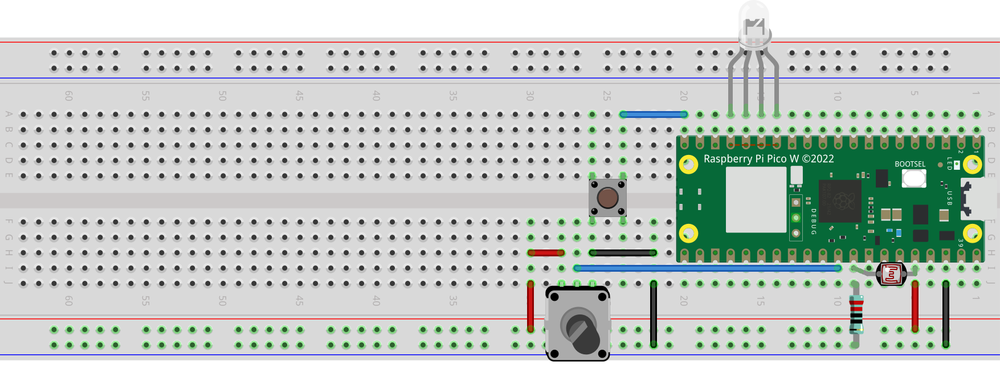
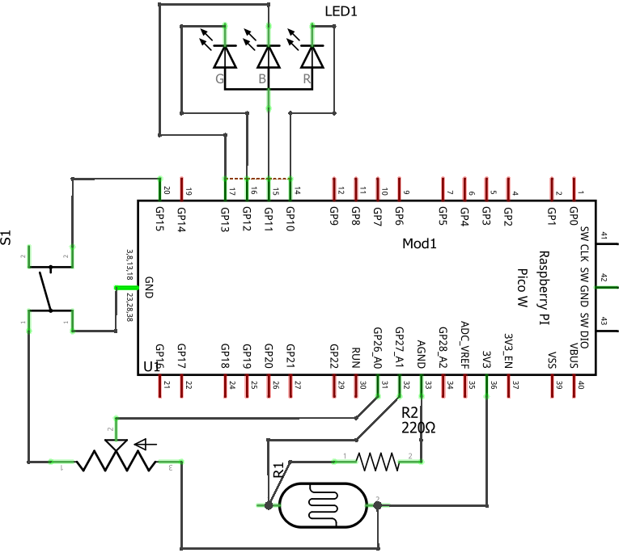

# Pico Pi Day Workshop

Welcome to the **Pico Pi Day Workshop**! In this workshop, you'll learn how to control LEDs using a Raspberry Pi Pico W, read data from sensors (photoresistor and potentiometer), and plot the data using MATLAB.

---
## 📑 Table of Contents
- [🌟 Pico Pi Day Workshop](#-pico-pi-day-workshop)
  - [📑 Table of Contents](#-table-of-contents)
  - [📝 Overview](#-overview)
  - [🚀 Getting Started](#-getting-started)
    - [1. Clone the Repository](#1-clone-the-repository)
    - [2. Install Thonny (if not installed)](#2-install-thonny-if-not-installed)
  - [💻 Code Explanation](#-code-explanation)
    - [**Python Code** (`main.py`)](#python-code-pico_controlpy)
      - [Key Components](#key-components)
      - [Main Functions](#main-functions)
    - [**MATLAB Code** (`plot_data.m`)](#matlab-code-plot_datam)
      - [Key Parts](#key-parts)
  - [🔧 Wiring Guide](#-wiring-guide)
    - [Schematics](#schematics)
  - [🎯 How to Run](#-how-to-run)
  - [🎁 Prizes](#-prizes)
  - [💡 Troubleshooting](#-troubleshooting)
  - [📚 Resources](#-resources)

---

## 📝 Overview
This workshop covers the basics of working with the Raspberry Pi Pico W microcontroller, including:
- GPIO (General Purpose Input/Output) pins
- PWM (Pulse Width Modulation) for LED control
- Reading data from photoresistors and potentiometers
- Data visualization with MATLAB

---

## 🚀 Getting Started
### 1. Clone the Repository
```bash
git clone https://github.com/satiresage/pi-day-workshop.git
cd pi-day-workshop
```
### 2. Install Thonny (if not installed)
- Download and install [Thonny](https://thonny.org/)
- Open Thonny → `Run → Configure Interpreter` → Install or Update MicroPython:
  - **Target:** Auto-select / RPI-RP2  
  - **Family:** RP2  
  - **Variant:** Raspberry Pi Pico W  
  - **Version:** Latest (1.24.1)  

---

## 💻 Code Explanation
### **Python Code** (`main.py/outdoor_light.py`)
The script controls the brightness and color of an LED using:
- **Photoresistor** – Adjusts LED brightness based on ambient light.
- **Potentiometer** – Adjusts LED hue and brightness.
- **Button** – Toggles between photoresistor and potentiometer control.

### **Key Components**
| Pin | Function |
|------|----------|
| `RED_PIN = 10` | Red PWM Pin |
| `GREEN_PIN = 12` | Green PWM Pin |
| `BLUE_PIN = 13` | Blue PWM Pin |
| `ANODE_PIN = 11` | Common Anode Pin for LED |
| `LDR_PIN = 27` | Photoresistor Pin |
| `POT_PIN = 26` | Potentiometer Pin |
| `BUTTON_PIN = 15` | Button Pin |
| `LED_PIN = "LED"` | Onboard Pico LED |

### **Main Functions**
1. `read_sensor()` – Reads sensor value based on active mode.
2. `check_button()` – Toggles control mode when button is pressed.
3. `hsv_to_rgb()` – Converts HSV values to RGB for LED control.
4. `run()` – Main loop to read sensor values and adjust LEDs.

For reference - HSV Conversion Table:
| Hue Range              | RGB Calculation                               |
| :--------------------- | :-------------------------------------------: |
| 0°–60°                 | Red is highest, green increases, blue is zero |
| 60°–120°               | Green is highest, red decreases, blue is zero |
| 120°–180°              | Green is highest, blue increases, red is zero |
| 180°–240°              | Blue is highest, green decreases, red is zero |
| 240°–300°              | Blue is highest, red increases, green is zero |
| 300°–360°              | Red is highest, blue decreases, green is zero |

---

### **MATLAB Code** (`plot_data.m`)
The MATLAB script:
- Reads data from the Pico via serial connection.
- Plots **voltage** and **resistance** in real-time.
- Differentiates between **photoresistor** and **potentiometer** modes.

#### **Key Parts**
1. Sets up a serial connection to the Pico:
```matlab
% Example:
portName = "/dev/cu.usbmodem2101";
baudRate = 115200;
device = serialport(portName, baudRate);
```
2. Parses Pico output:
```matlab
modeTokens = regexp(lineOfData, 'Mode:\s*([A-Za-z]+)', 'tokens');
sensorTokens = regexp(lineOfData, 'Sensor:\s*(\d+)', 'tokens');
```
3. Converts ADC reading to voltage and resistance:
```matlab
sensorVoltage = (currentSensorValue / 65535) * 3.3;
sensorResistance = R_fixed * ((3.3 - sensorVoltage) / sensorVoltage);
```
4. Updates plots dynamically using drawnow.

## 🔧 Wiring Guide
| Pin | Component | Pico Pin |
|------|-----------|----------|
| Red LED | LED (Red) | GP10 |
| Green LED | LED (Green) | GP12 |
| Blue LED | LED (Blue) | GP13 |
| Photoresistor | Voltage Divider | GP27 |
| Potentiometer | Input | GP26 |
| Button | Input | GP15 |

### **Schematics**
<div align="center">
  
  
</div>

---

## 🎯 How to Run
1. Upload `main.py` and `outdoor_light.py` to the Pico using Thonny.
2. Open MATLAB.
3. Run `plot_data.m`.

---

## 🎁 Prizes
Follow us on Instagram at **[@sfu_matlab](https://instagram.com/sfu_matlab)** and **[@matlab_students](https://instagram.com/matlab_students)** for tips, tricks, and future events!

---

## 💡 Troubleshooting
| Issue | Solution |
|-------|----------|
| No serial connection | Check that the Pico is connected to the correct port and baud rate |
| Incorrect plotting | Verify that the correct mode (photoresistor/potentiometer) is active |
| LED not changing color | Ensure correct wiring and check PWM pin assignment |

---

## 📚 Resources
- [Raspberry Pi Pico Documentation](https://datasheets.raspberrypi.com/pico/pico-datasheet.pdf)
- [MATLAB Serial Communication](https://www.mathworks.com/help/matlab/serial-communication.html)
- [Pulse Width Modulation (PWM)](https://www.youtube.com/watch?v=aeE0u1J-1pg)

---
